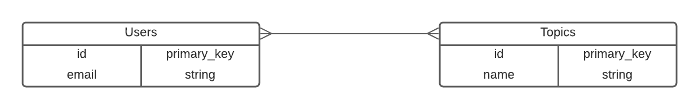

# Micolet coding challenge

## Table of contents
* [Setup](#setup)
* [General info](#general-info)
* [Technologies](#technologies)

## Setup
To get the Rails server running locally:

- Clone this repo
- `bundle install` to install all required dependencies
- `rails db:create` to create postgresQL database we're using,
- `rails db:migrate` to make all database migrations
- `rails db:seed` to create the topics (preferences)
- Create a copy of .env.example and put your API key from https://www.abstractapi.com/email-verification-validation-api. In addition, GMAIL_COLLECTIVIA and GMAIL_PASSWORD are necessary. Then, rename the .env.example file to .env.
- `rails s` to start the local server
- `rails test` to run tests

## General info
This project is a service that provides the following functionalities:

- We can stores user's email and their preferences.
- When the user clicks the subscrite button, an confirmation email is sended.
- Validations works in accord to the requirements.
- We can add more preferences options, this have to be add in seeds.rb file.
- Tests were implemented

We based on database schema showing in the image below:

## Technologies
Project is created with:
* Ruby version:  2.7.5
* Rails version: 7.0.2.3
* PostgreSQL: 12.9
	
